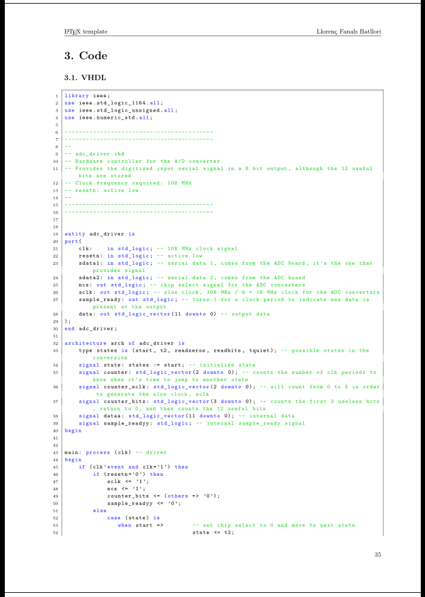

# LaTeX-template

This repository contains the template that I've been using since September 2019, first at the Bachelor's Degree in Electronics at UdG and later at the Master's Degree in Electronics at ETSETB, UPC. After hundreds of documents, it has proven to be very useful to create elegant documents in a short span of time. I honestly believe that without LaTeX, it would have taken me a longer time to create documents of less quality.

This template eases the following tasks:

- Differentiating between statement and solution.
- Typing equations and sets of equations.
- Inserting images, vectorial sketches, plots and electronic schematics.
- Inserting VHDL and C code.

## Screenshots

Titlepage:

Table of contents:

Statement and solution:

Laboratory report:

Vectorial plot:

Code:

## Suggestions

Although this template has worked fine on both Windows and Linux, I prefer the later. My current workflow is based on:

- **Arch Linux** as the operating system.
- **Qtile** as the window manager.
- **Vim** as the text editor, plus some snippets and LaTeX packages.
- **Ranger** as the file manager.
- **Zathura** as the PDF viewer.
- **Git** as the version control software.
- **Flameshot** as the program to take screenshots.
- **[LFanals/CircuiTikZ-tool](https://www.github.com/LFanals/CircuiTikZ-tool)** as the program to speed the creation of schematics.
- **Qutebrowser** as the main browser.

## Pending

- Bibliography
